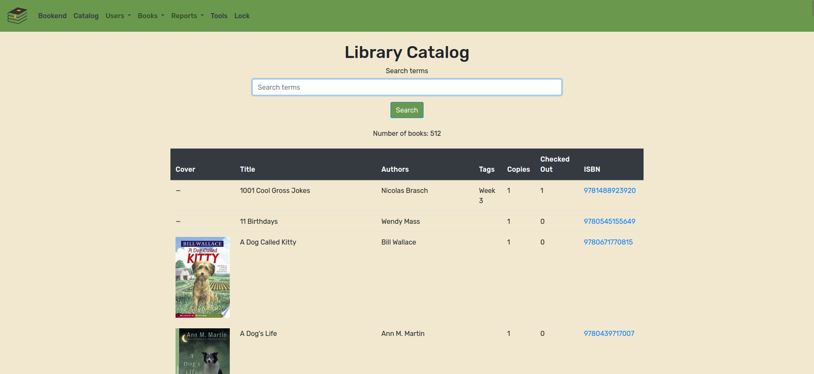

# Bookend


The classroom-oriented library management software with rich features for teachers and a simple-to-use interface for students.

<div align="center">
    
</div>

<!-- TOC -->
* [Bookend](#bookend)
* [Overview](#overview)
* [Interested? Try out the demo!](#interested-try-out-the-demo)
* [Get Bookend](#get-bookend)
  * [Managed](#managed)
  * [Self-hosted](#self-hosted)
* [All features](#all-features)
* [Instructions and tutorials](#instructions-and-tutorials)
* [Inspiration](#inspiration)
<!-- TOC -->

# Overview

Use a touch screen friendly interface to check in/out books
<div align="center">
    
</div>

Students can use a USB barcode scanner to enter their library card number 
and book ISBN without typing a single number
<div align="center">
    
</div>

* Search your library catalog by title, author, user-defined tags, and ISBN
* Track the total number of copies you have of each title
* Keep up to date with how many books are currently checked out
* Browse auto-generated cover thumbnails from Google Books
<div align="center">
    
</div>

Easily add books by ISBN with a USB barcode scanner. All book attributes are automatically populated by Google Books and can 
be modified after a book has been added to the catalog. Manually add books that do not have an ISBN or are not listed on Google Books.
<div align="center">
    
</div>

Straightforward interface for viewing users names, library card numbers, and books a user has checked out.
<div align="center">
    
</div>

Built-in barcode generation for library card numbers and book ISBNs - handy for customized library cards and adding ISBN stickers to books!

<div align="center">
    
    
</div>

.. and much, much more!


# Interested? Try out the demo!

[Try out the demo site here!](http://cknutson.org:8080) Data is reset every 15 minutes.

# Get Bookend

Bookend is free open-source software (FOSS) that can be used by anyone. If you would like to use Bookend without 
worrying about setting up a computer to run the software on, see the [Managed](#managed) section below to pay for your own 
private instance of the software. If you want to host your own instance for free, see the [Self-hosted](#self-hosted) section.

## Managed
[Contact me](https://forms.gle/zppJBV8Aq3N4i6FY6) if you are interested in a managed instance of Bookend.

## Self-hosted
The recommended hosting method is to use the pre-compiled Docker image. 

1. [Install Docker](https://www.docker.com/get-started/) on your desired machine.
2. **Ensure your machine is only accessible via a secure network -- currently there is no authentication or SSL/TLS encryption in Bookend**, 
so ensure your instance is sufficiently secured for your needs. I would recommend using a VPN service like [Tailscale](https://tailscale.com/) and 
only binding your server to your VPN network interface by setting the `<YOUR_HOSTNAME_OR_IP>` value as shown below.
3. Run the Docker container, replacing `<RANDOM_SECRET_KEY_VALUE>` with a randomly generated key, `</PATH/TO/STORE/YOUR/DATABASE>` 
with the location on your local machine to store your persistent sqlite3 database, and `<YOUR_HOSTNAME_OR_IP>` with 
the hostname/IP you'd like to bind your instance to (defaults to `localhost`):
    ```
   docker run -d --name=bookend \
        -v </PATH/TO/STORE/DATABASE>/db.sqlite3:/app/db.sqlite3:rw \
        --env DJANGO_SECRET_KEY="<RANDOM_SECRET_KEY_VALUE>" \
        --env ALLOWED_HOST="<YOUR_HOSTNAME_OR_IP>" \
        --rm -p 8080:8080 \
        rogueraptor7/bookend:latest
    ```

# All features

* USB Barcode scanner support for all fields
  * Use a bluetooth barcode scanner and turn an old iPad into a kiosk
* "Kiosk" mode for students, only allowing access to check in and check out functionalities
* Books 
  * Add books to your library by scanning the ISBN
    * Google Books attempts to autopopulate book title, subtitle, authors, publisher, publish date, description, page count, categories, average rating, maturity rating, 
      thumbnail image, and public domain fields based on the ISBN. 
  * If a field is not autopopulated or is incorrect, you can manually edit the field
    after the fact.
  * Additional fields, such as the number of copies in your library, and the number of copies checked out are also stored.
  * You may also manually enter in book details if the book does not have an ISBN.
    * ISBN code pictures are automatically generated and can be saved for sticker printing for books that do not have ISBNs.
  * Search and sort books by title, authors, custom tags, and ISBN.
  * Add custom searchable tags to books ("Unit 4", "Fall book club", etc.).
* Users
  * Add and remove users with a unique library card number.
  * Barcodes are generated for each user for use in custom scannable library cards.
  * Easily see which books each user has checked out.
* Reports
  * Generate .csv reports of:
    * All books currently in your library, including how many unique copies you have and how many are checked out.
    * All users signed up and which books they have checked out.
* Tools
  * Import an existing spreadsheet of books into Bookend **experimental


# Instructions and tutorials
Coming soon!


# Inspiration
Bookend is an electronic library management tool aimed to make classroom library management easier for
elementary school educators. Teachers typically have hundreds of books in their library, with many books lent out to their students at a time.

Some teachers use spreadsheets to keep track of their library, but constantly updating a spreadsheet is time-consuming and can lead to confusion.

_Bookend_ is the much needed successor, providing a robust system for book tracking and putting an **end** to Google Sheet back-ends!
